# device_systems API v3.0

API REST para la gestion de usuarios del sistema device_systems con persistencia de datos mediante SQLAlchemy y SQLite.

## Estructura del proyecto

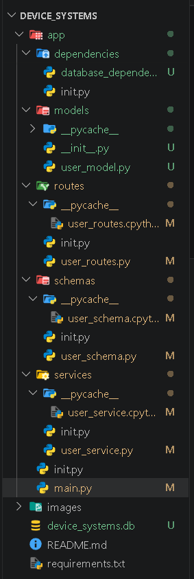

## Base de datos generada

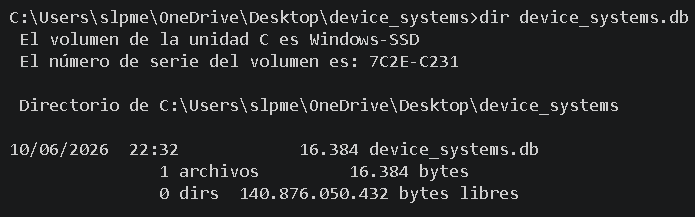

## Swagger UI

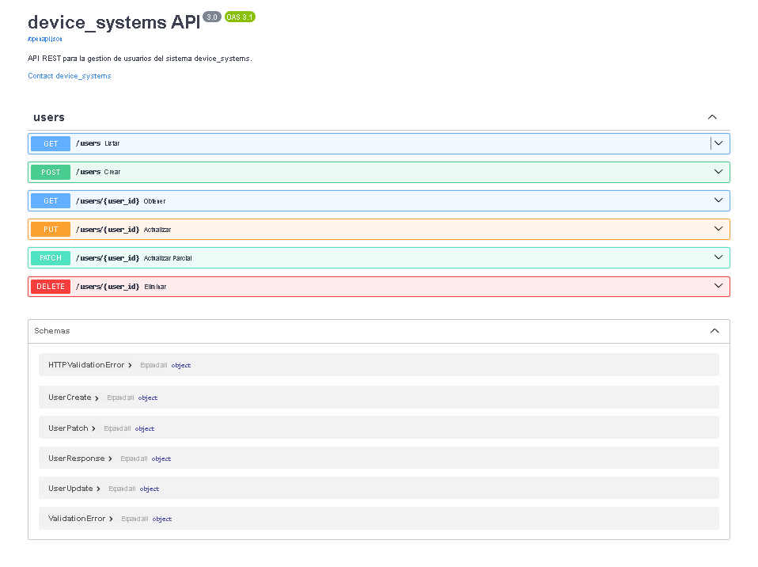

## Pruebas de endpoints

### Prueba 1 - Crear usuario valido (POST /users) - 201
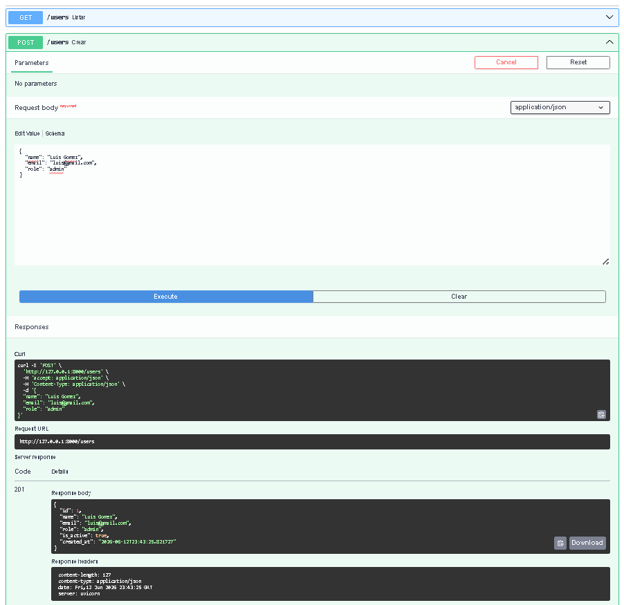

### Prueba 2 - Email repetido (POST /users) - 400
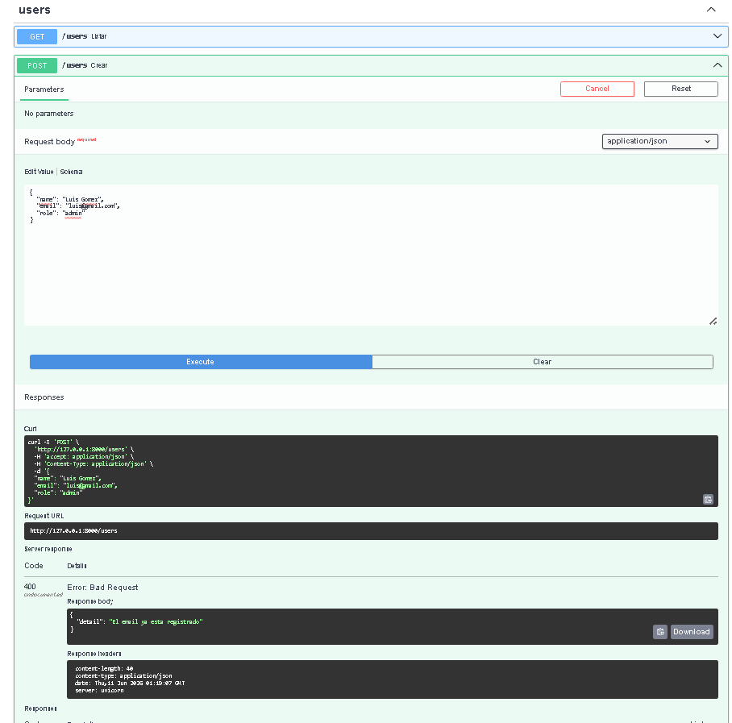

### Prueba 3 - Listar usuarios (GET /users) - 200
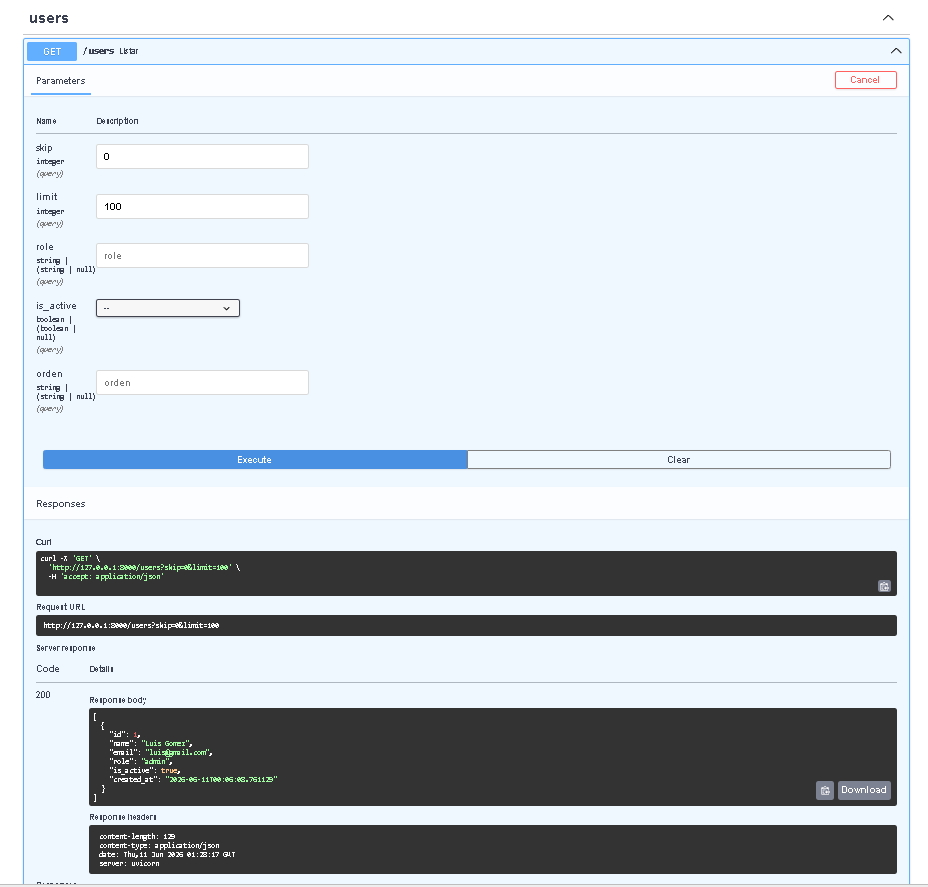

### Prueba 4 - Consultar por ID (GET /users/1) - 200
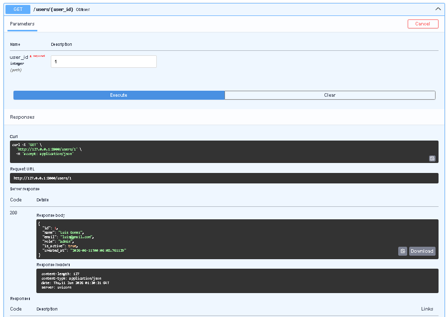

### Prueba 5 - Usuario inexistente (GET /users/999) - 404
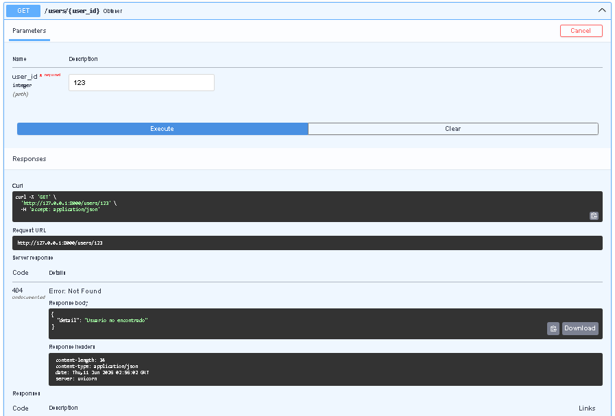

### Prueba 6 - Filtrar por rol (GET /users?role=admin) - 200
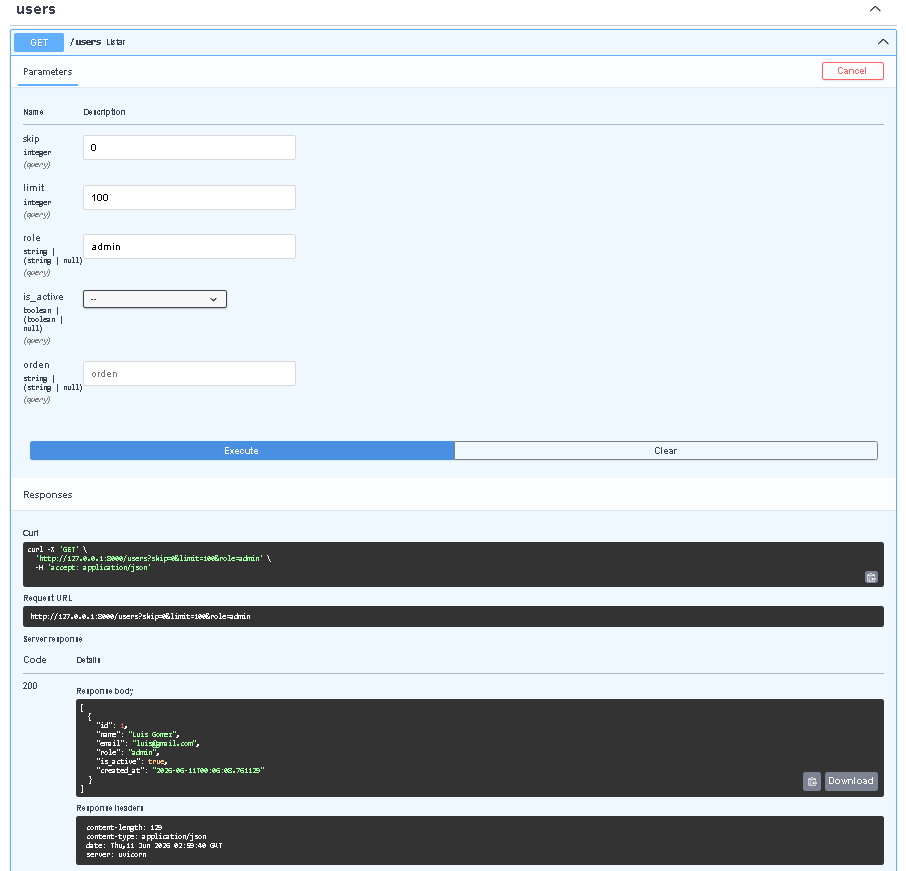

### Prueba 7 - Filtrar activos (GET /users?is_active=true) - 200
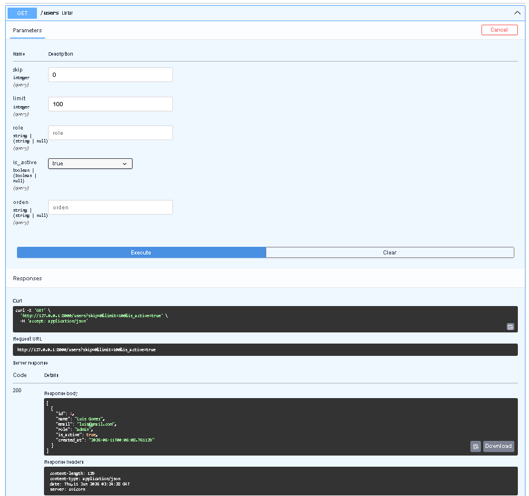

### Prueba 8 - Actualizar completo (PUT /users/1) - 200
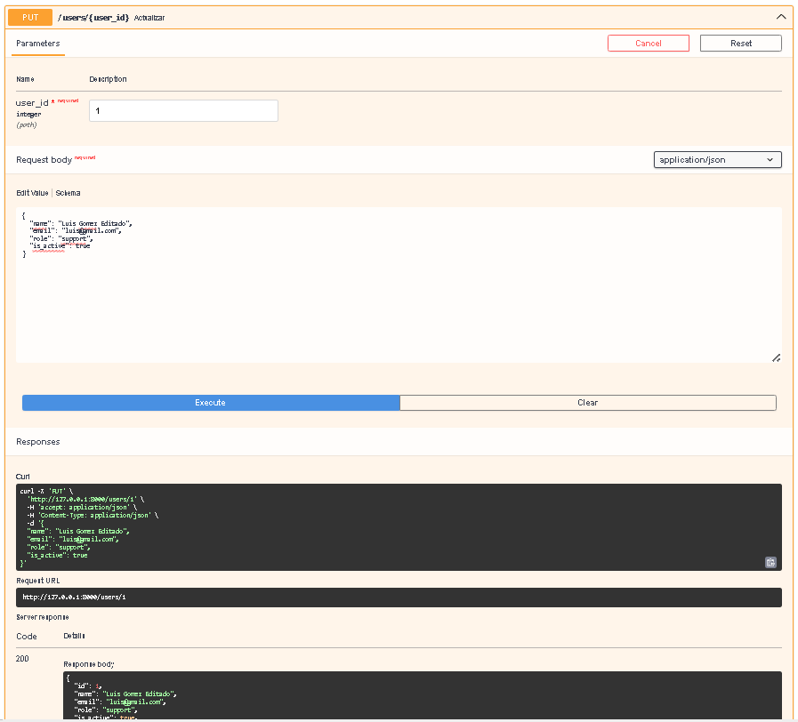

### Prueba 9 - Actualizar parcial (PATCH /users/1) - 200
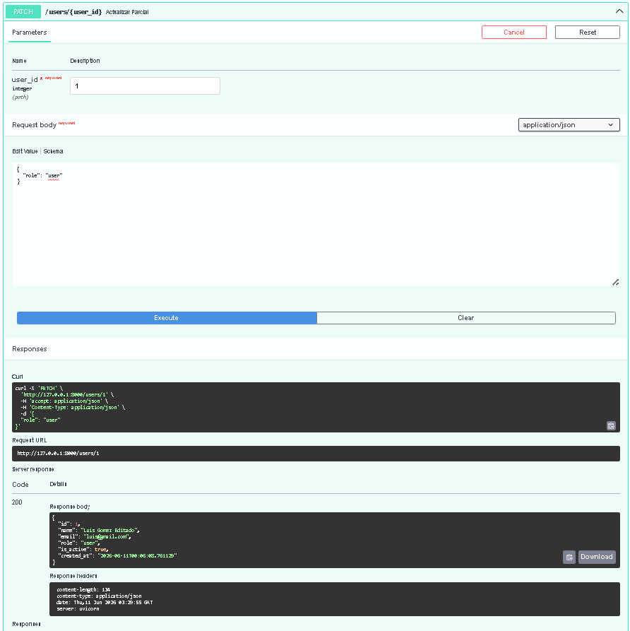

### Prueba 10 - Eliminar usuario (DELETE /users/1) - 204
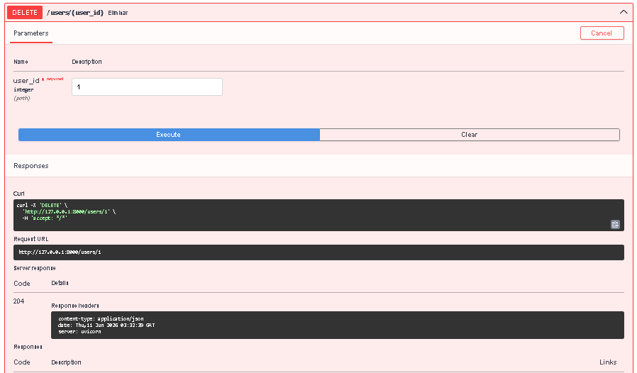

### Prueba 11 - Verificar eliminado (GET /users/1) - 404
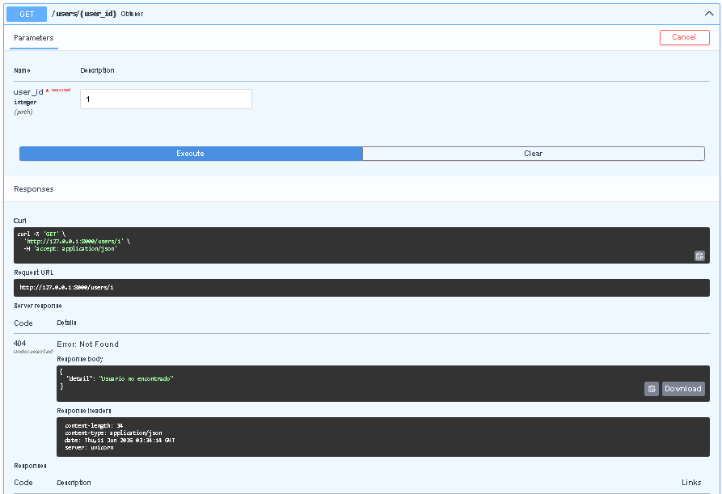

## Diferencia entre modelo SQLAlchemy y schema Pydantic

El modelo SQLAlchemy representa la tabla en la base de datos. Define las columnas, tipos de datos y restricciones a nivel de base de datos como nullable, unique y primary key. Es la capa que se comunica directamente con SQLite.

El schema Pydantic define la estructura de datos para la entrada y salida de la API. Aplica validaciones a nivel de aplicacion como longitud minima, formato de email y valores permitidos para el rol. No tiene relacion directa con la base de datos.

## Reflexion final

Usar persistencia en una API REST es fundamental porque los datos no se pierden cuando el servidor se reinicia. En la version anterior los usuarios se guardaban en memoria y se borraban al detener el servidor. Con SQLAlchemy y SQLite los datos quedan almacenados en un archivo fisico, lo que permite que la API funcione como una aplicacion real. Ademas el uso de un ORM facilita las operaciones sobre la base de datos sin necesidad de escribir SQL directamente.