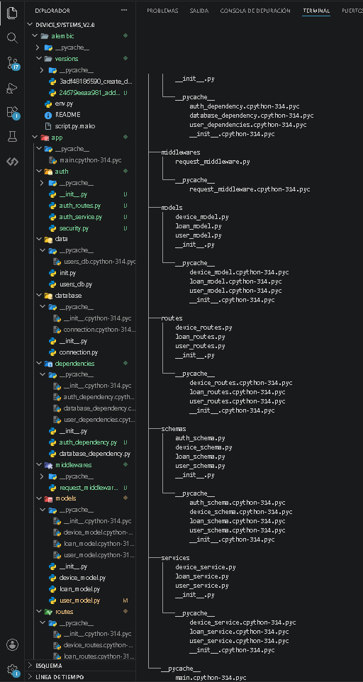
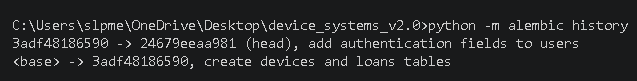

# device_systems API v2.0

API REST segura para la gestion de usuarios, dispositivos y prestamos, construida con FastAPI, SQLAlchemy, Alembic y autenticacion OAuth2 con JWT.

## Estructura del proyecto

## Instalacion

pip install -r requirements.txt

Copiar .env.example a .env y configurar las variables.

Aplicar migraciones:

python -m alembic upgrade head

Iniciar el servidor:

python -m uvicorn app.main:app --reload

## Variables de entorno (.env.example)

SECRET_KEY=tu_clave_secreta_aqui
ALGORITHM=HS256
ACCESS_TOKEN_EXPIRE_MINUTES=30
DATABASE_URL=sqlite:///./device_systems.db

## Migracion Alembic aplicada

## Autenticacion

La API usa OAuth2 con tokens JWT. Para acceder a rutas protegidas:

1. Registrar un usuario: POST /auth/register
2. Hacer login: POST /auth/login
3. Usar el token en el header: Authorization: Bearer token

### Endpoints de autenticacion

| Metodo | Ruta | Descripcion | Limite |
|--------|------|-------------|--------|
| POST | /auth/register | Registrar usuario | 3/minuto |
| POST | /auth/login | Login y token JWT | 5/minuto |
| GET | /auth/me | Datos del usuario autenticado | - |

## Pruebas funcionales

### Registro de usuario

[Registro de usuario](images4/registro_de_usuario.png)

### Login y token generado

[Login y token](images4/login_y_token_generado.png)

### Consulta /auth/me

[Auth me](images4/auth_me.png)

### Acceso sin token - 401

[Sin token](images4/acceso_sin_token.png)

### Acceso con rol no permitido - 403

[Rol no permitido](images4/acceso_con_rol_no_permitido.png)

### Swagger con OAuth2

[Swagger OAuth2](images4/Swagger.png)

### Cabeceras del middleware

[Cabeceras middleware](images4/cabeceras_del_middleware.png)

### Rate limiting - 429

[Rate limiting](images4/rate_limiting.png)

## Proteccion de rutas

| Ruta | Proteccion requerida |
|------|----------------------|
| GET /users | Usuario autenticado |
| GET /users/{id} | Usuario autenticado |
| POST /users | Admin |
| PUT /users/{id} | Admin |
| DELETE /users/{id} | Admin |
| POST /devices | Admin o support |
| PUT /devices/{id} | Admin o support |
| DELETE /devices/{id} | Admin |
| POST /loans | Usuario autenticado |
| PATCH /loans/{id}/return | Admin o support |
| GET /loans/details | Admin o support |

Roles disponibles: admin, support, user

## Hash de contrasenas

Las contrasenas nunca se guardan en texto plano. Se usa passlib con el algoritmo bcrypt:

get_password_hash(password)    genera el hash
verify_password(plain, hashed) verifica la contrasena

El campo hashed_password nunca se expone en los response models.

## Validaciones de contrasena con Pydantic v2

- Minimo 8 caracteres
- Al menos una mayuscula
- Al menos una minuscula
- Al menos un numero
- Sin espacios en blanco

## Middleware personalizado

Cada peticion agrega automaticamente las cabeceras:

X-App-Name: device_systems
X-Process-Time: 0.0037
X-Request-ID: caad29d2

Tambien registra en consola el metodo, ruta y codigo de estado de cada peticion.

## Configuracion CORS

allow_origins=["http://localhost:5173", "http://localhost:3000"]
allow_credentials=True
allow_methods=["*"]
allow_headers=["*"]

### Por que no se recomienda usar asterisco en produccion con credenciales

Cuando allow_credentials es True, el navegador exige que allow_origins sea una lista
explicita de dominios y no acepta el comodin asterisco. Si se usara asterisco con
credenciales, el navegador bloquearia las peticiones por politica de seguridad CORS.

Ademas, permitir todos los origenes en produccion expone la API a peticiones de cualquier
dominio, lo que facilita ataques CSRF y el acceso no autorizado desde sitios maliciosos.
En produccion siempre se deben especificar unicamente los dominios del frontend autorizado.

## Rate Limiting

| Endpoint | Limite |
|----------|--------|
| POST /auth/login | 5 solicitudes/minuto |
| POST /auth/register | 3 solicitudes/minuto |
| GET /users | 30 solicitudes/minuto |
| POST /loans | 10 solicitudes/minuto |

Cuando se supera el limite, la API responde con 429 Too Many Requests.

## Reflexion final sobre la importancia de la seguridad en APIs REST

Implementar seguridad en una API REST no es opcional, es una responsabilidad fundamental.
A lo largo de esta actividad aprendi que proteger los datos de los usuarios requiere
multiples capas trabajando juntas.

El hash de contrasenas con bcrypt garantiza que incluso si la base de datos es comprometida,
las contrasenas reales permanecen protegidas. Los tokens JWT permiten autenticar cada
peticion sin necesidad de enviar credenciales en cada llamada, reduciendo el riesgo de
exposicion. La autorizacion por roles asegura que cada usuario solo puede realizar las
operaciones que le corresponden segun su nivel de acceso.

El middleware de trazabilidad permite detectar comportamientos anomalos, medir el
rendimiento y hacer seguimiento de cada peticion mediante un ID unico. El rate limiting
protege contra ataques de fuerza bruta y abuso de endpoints. La configuracion de CORS
controla exactamente que origenes pueden consumir la API, evitando accesos no autorizados
desde dominios externos.

Cada una de estas capas por separado aporta proteccion, pero juntas construyen una API
profesional, confiable y lista para entornos reales. La seguridad debe pensarse desde el
diseno inicial del proyecto, no como algo que se agrega al final del desarrollo.

## Tecnologias utilizadas

- FastAPI
- SQLAlchemy 2.0
- Alembic
- Pydantic v2
- Passlib con bcrypt
- Python-jose para JWT
- Slowapi para rate limiting
- SQLite