# FastAPI Avanzado: Migraciones con Alembic, Asociaciones de Modelos y Consultas con Joins
## Proyecto: device_systems_v2.0

## Descripcion General

Esta version extiende la API device_systems con tres capacidades fundamentales:

1. Migraciones de base de datos con Alembic
2. Asociaciones entre modelos (User, Device, Loan)
3. Consultas avanzadas con joins y filtros

## Fase 3 - Configuracion de Alembic

### Paso 1: alembic init
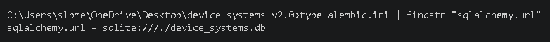

### Paso 2: alembic revision --autogenerate
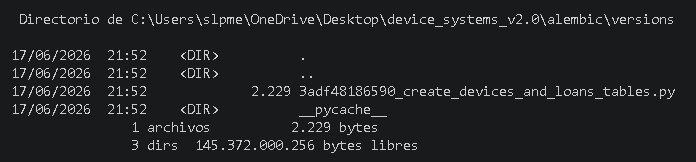

### Paso 3: alembic upgrade head
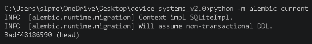

### Paso 4: alembic history
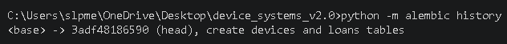

### Paso 5: Estructura de tablas generadas
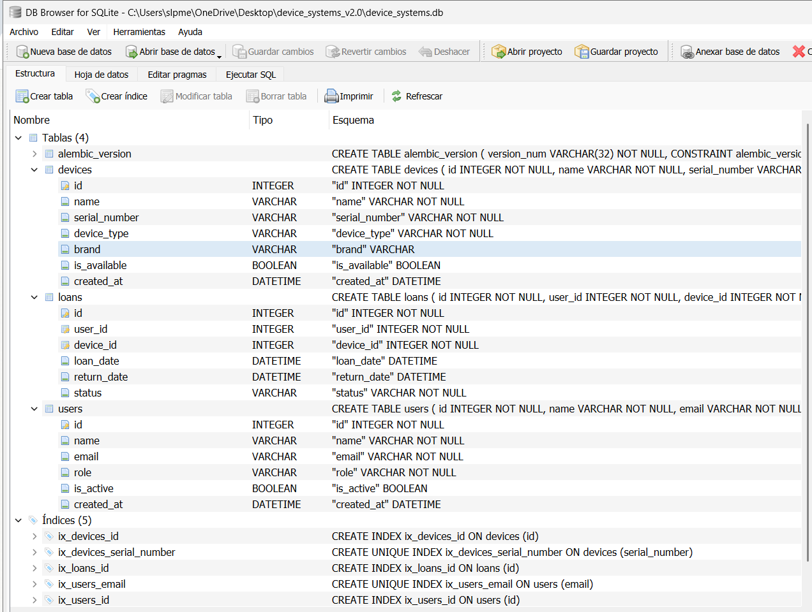

## Modelos y Relaciones

User tiene los campos id, name, email, role, is_active, created_at y se relaciona con loans en one-to-many.

Device tiene los campos id, name, serial_number, device_type, brand, is_available, created_at y se relaciona con loans en one-to-many.

Loan tiene los campos id, user_id, device_id, loan_date, return_date, status y se relaciona con User y Device en many-to-one.

## Endpoints

### Users
- GET /users - Listar usuarios
- POST /users - Crear usuario
- GET /users/{id} - Obtener por ID
- PUT /users/{id} - Actualizar completo
- PATCH /users/{id} - Actualizar parcial
- DELETE /users/{id} - Eliminar
- GET /users/{id}/loans - Prestamos del usuario

### Devices
- GET /devices - Listar con filtros
- POST /devices - Crear dispositivo
- GET /devices/{id} - Obtener por ID
- PUT /devices/{id} - Actualizar completo
- PATCH /devices/{id} - Actualizar parcial
- DELETE /devices/{id} - Eliminar
- GET /devices/{id}/loans - Historial prestamos

### Loans
- GET /loans - Listar con filtros
- GET /loans/details - Listar con join completo
- POST /loans - Crear prestamo
- GET /loans/{id} - Obtener por ID
- PATCH /loans/{id}/return - Devolver dispositivo

## Evidencias Swagger UI

### Vista general de la API
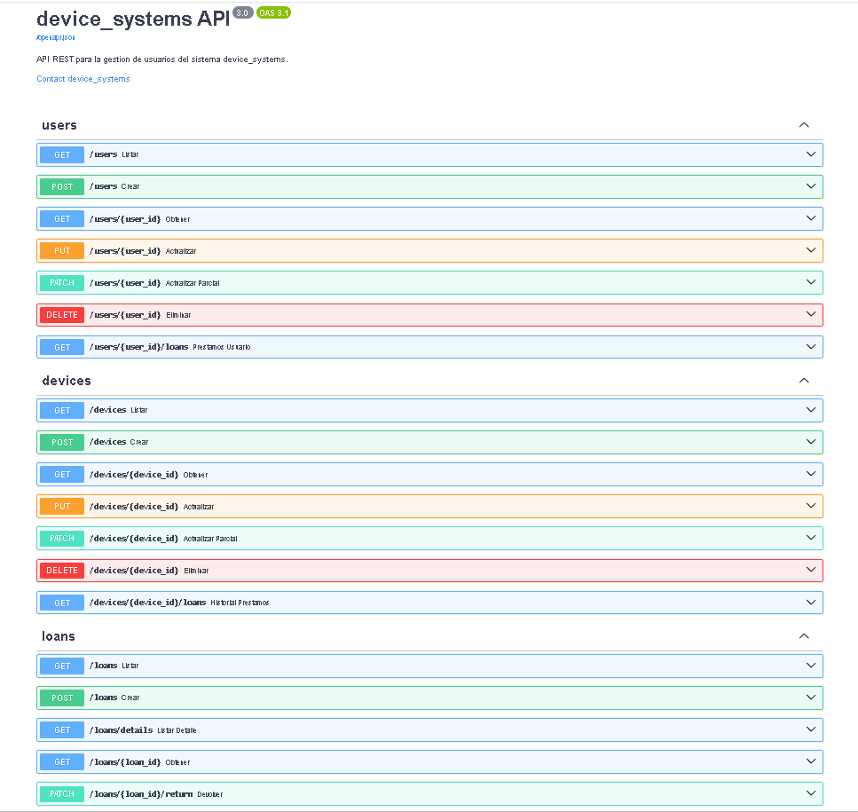

### Crear usuario - 201
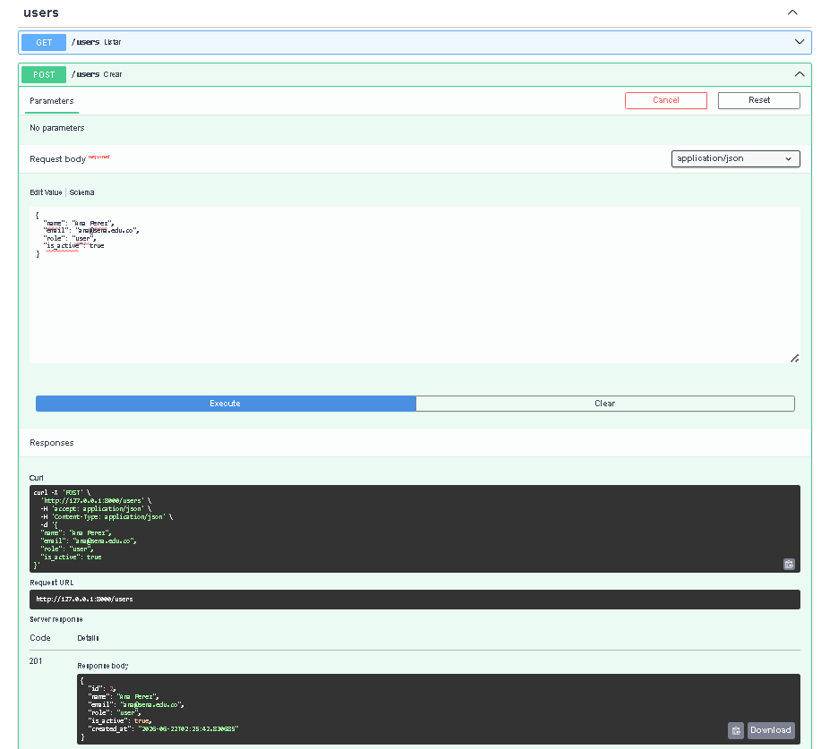

### Crear dispositivo - 201
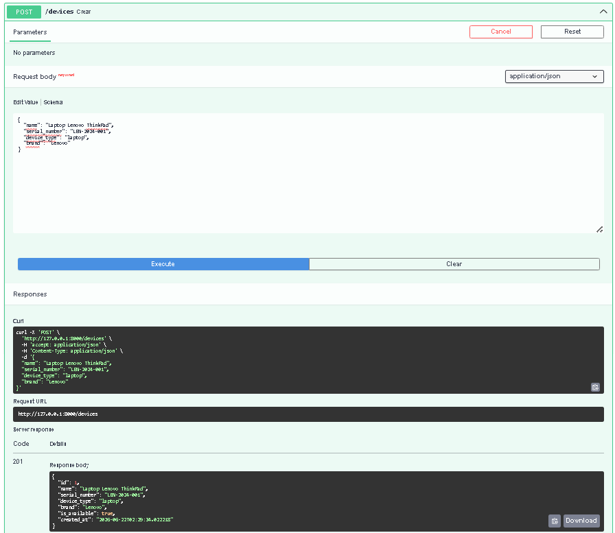

### Crear prestamo - 201
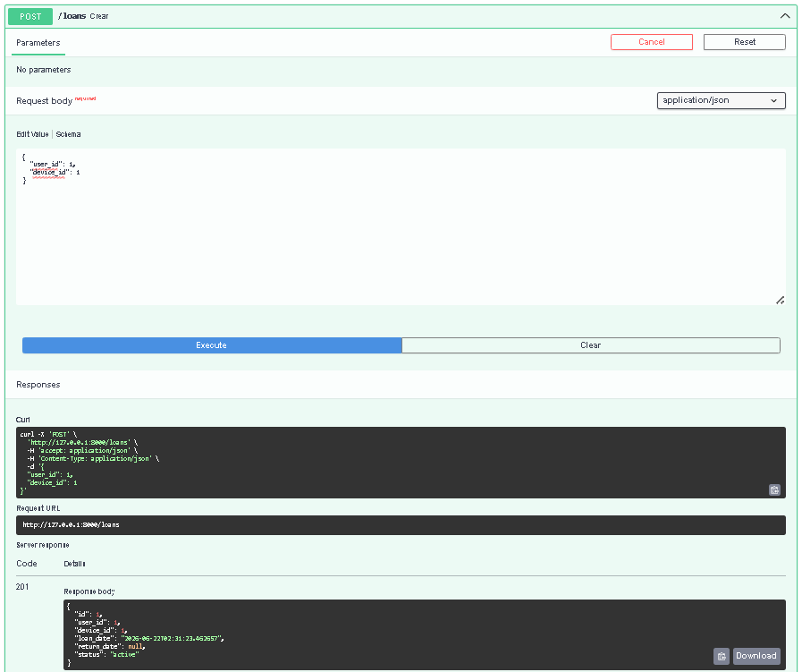

### Dispositivo no disponible - 409
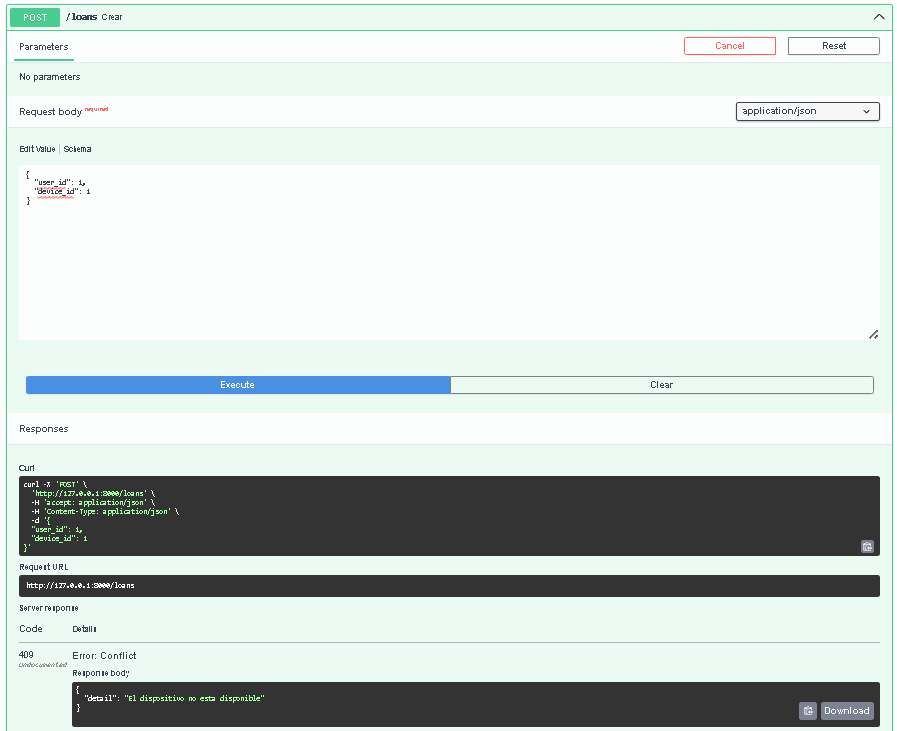

### Consulta con join - GET /loans/details
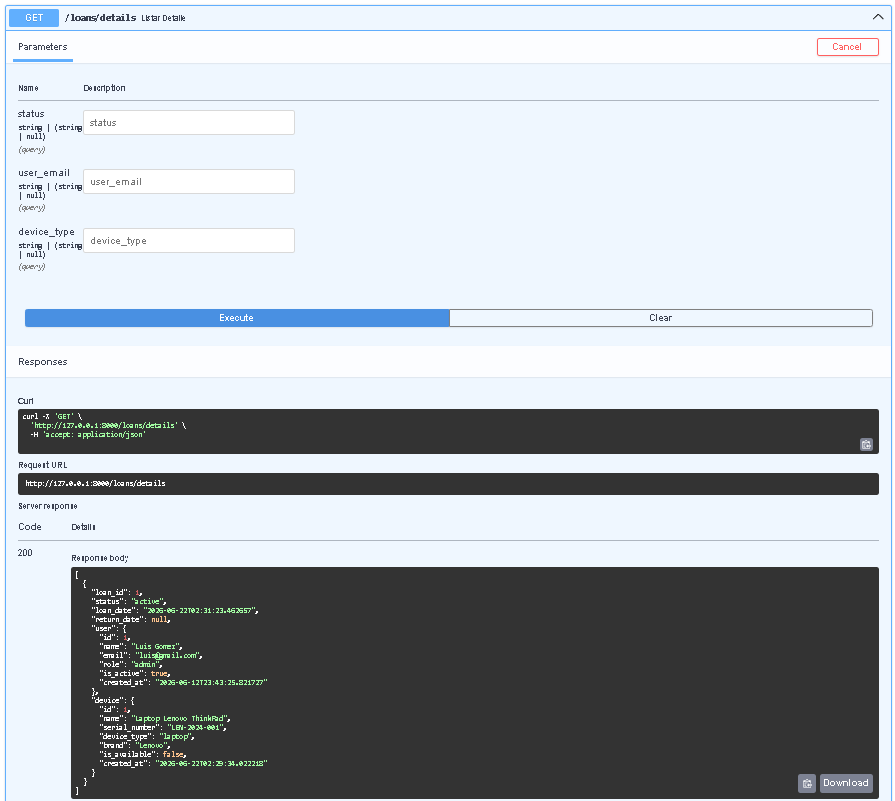

### Filtro por estado active
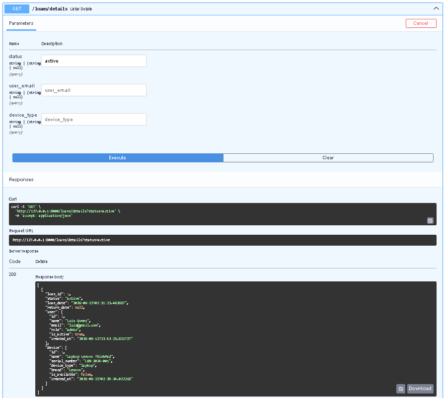

### Filtro por tipo de dispositivo laptop

### Prestamos de un usuario
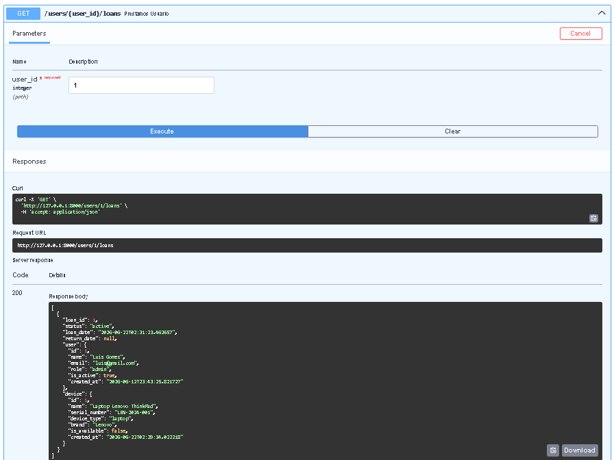

### Devolucion de dispositivo - 200
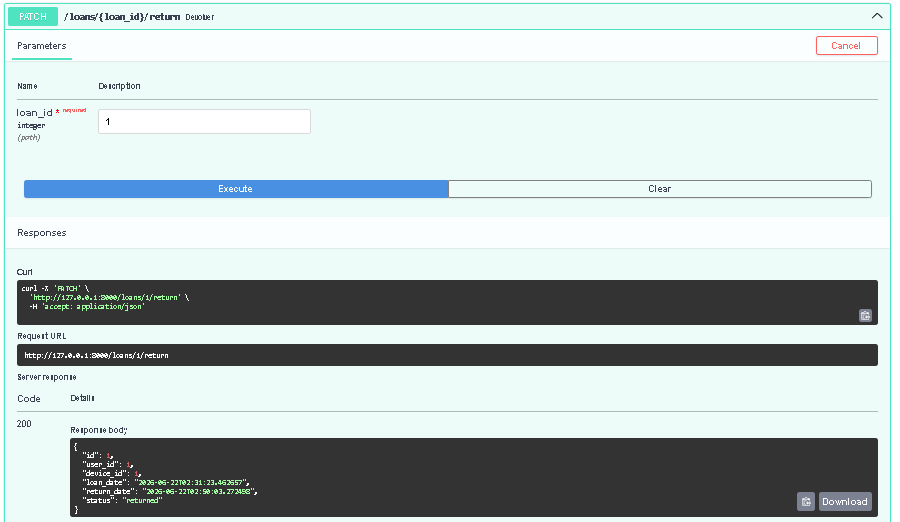

### Dispositivo disponible de nuevo
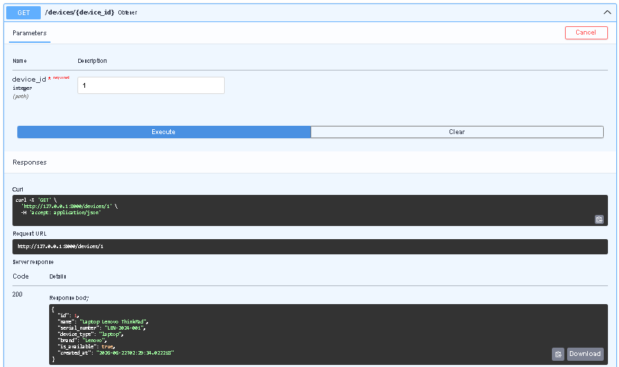

### Historial del dispositivo
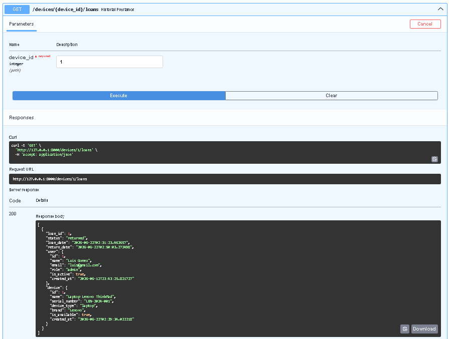

## Reflexion

Las migraciones con Alembic permiten versionar los cambios estructurales de la base
de datos de forma controlada. Esto es fundamental en equipos de trabajo donde varios
desarrolladores modifican el esquema: sin migraciones cada desarrollador tendria que
aplicar cambios manuales generando inconsistencias entre entornos.

Las relaciones entre modelos permiten representar la realidad del negocio de forma
natural. Un usuario puede tener muchos prestamos y un dispositivo puede aparecer en
el historial de varios prestamos. Usar relationship() con back_populates hace que
SQLAlchemy maneje automaticamente la carga de datos relacionados sin necesidad de
consultas adicionales.

Las consultas con joins y filtros avanzados son indispensables en una API real.
El endpoint GET /loans/details combina tres tablas en una sola consulta eficiente.
Los filtros por estado, email o tipo de dispositivo hacen que la API sea util para
casos de uso concretos sin traer datos innecesarios al cliente.